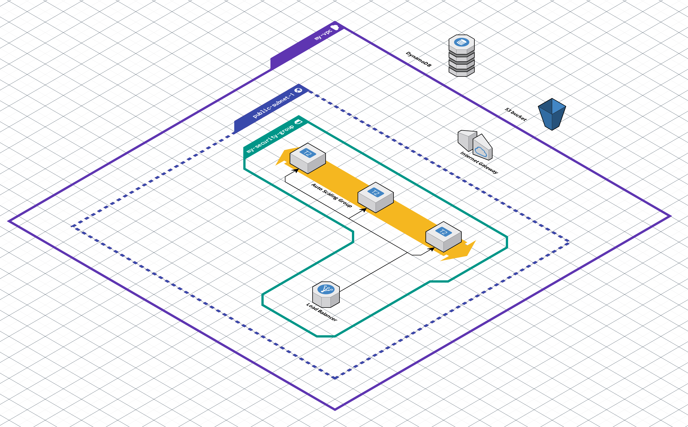

# Creating a Production-Ready AWS Network using Terraform

The objective of this project is to establish a robust and highly reproducible infrastructure for hosting a static website on Amazon Web Services (AWS). Leveraging the power of Terraform, this project delivers a modular and automated approach to infrastructure provisioning, ensuring scalability, security, and ease of management.


## Overview

Efficient infrastructure management and reproducibility are key considerations when deploying web applications. This Terraform project simplifies these aspects by automating the deployment of essential AWS resources. It enables you to easily create a production-ready AWS network, whether you're launching a static website, deploying web services, or building complex applications. The modular and reproducible infrastructure provided streamlines the process, allowing you to focus on your project's core functionality.

#### Remote State:

A fundamental component of this project is the establishment of an S3 Bucket and DynamoDB backend for Terraform. This combination ensures that the state of your infrastructure is stored securely and can be collaboratively managed by your team. It simplifies version control and locks state changes to prevent conflicts, enabling a seamless development experience. Remote state is a critical aspect of infrastructure as code (IaC) projects, as it centralises the storage of Terraform's state files on a remote backend. This provides several benefits, including:

- Collaboration: Multiple team members can work on the same infrastructure code without conflicts.

- State Locking: Prevents concurrent writes to the state, ensuring data consistency.

- Secure Storage: Protects sensitive information, such as secrets and API keys, by storing state data remotely.

#### VPC:

To isolate and organise your AWS resources effectively, this project includes the creation of a Virtual Private Cloud (VPC). The VPC serves as the foundation for your network architecture, allowing you to define public and private subnets, configure route tables, and establish secure network connectivity.

#### EC2:

The EC2 Instances module defines the provisioning of Amazon Elastic Compute Cloud (EC2) instances, which are the essential workhorses of your AWS infrastructure, responsible for hosting web content, applications, and services. This module offers flexibility in deploying a customizable number of EC2 instances, meeting the specific requirements of your applications and services.

#### Security Groups:

The Security Group module defines rules and configurations for an AWS security group, acting as a virtual firewall for your Amazon Elastic Compute Cloud (EC2) instances. It controls inbound and outbound traffic based on specified rules. These rules are conditionally defined using variables, enabling you to allow or disallow specific types of traffic to your AWS resources.

#### Load Balancer:

The Load Balancer module configures an Amazon Web Services (AWS) Application Load Balancer (ALB), efficiently distributing incoming traffic across multiple EC2 instances to ensure the high availability, reliability, and optimal performance of your applications. By evenly distributing incoming traffic among your EC2 instances, this module plays a pivotal role in enhancing the overall reliability and performance of your website.

#### Auto Scaling Group:

The Auto Scaling Group (ASG) module defines configurations for an AWS Auto Scaling Group, automating the scaling of EC2 instances based on predefined criteria to ensure consistent application availability and performance. This module seamlessly adapts to fluctuating workloads, offering dynamic scaling capabilities that efficiently manage varying resource demands, ultimately ensuring cost-effective resource utilization.

## Infrastructure Diagram




<br>

Visualising the architecture of your AWS infrastructure is essential for understanding and maintaining it. The diagram above provides an example of the resources and their relationships within this Terraform project. This diagram was generated using [Cloudcraft](https://cloudcraft.co/), a tool that simplifies AWS architecture visualisation.


## Prerequisites

Before getting started, ensure you have the following prerequisites installed and configured:

-   _**[Terraform](https://www.terraform.io/downloads.html)**_
-   _**[AWS CLI](https://aws.amazon.com/cli/)**_
-   Fork and clone **_[this repo](https://github.com/Darren-Wilby/aws-terraform-project)_**

> Note: You must have an AWS account and the AWS CLI configured with valid credentials. If you haven't set up the AWS CLI, you can do so by following the [**_AWS CLI documentation_**](https://docs.aws.amazon.com/cli/latest/userguide/cli-configure-files.html).


## Configuration and Usage

1. **Authentication**: Configure the necessary authentication for AWS.

2. **Variable Values**: Update the `terraform.tfvars` file with the desired values for your project. You can also use environment variables or command-line flags to override variable values.

3. **Main Configuration**: Customise the `main.tf` file to match your specific infrastructure requirements. Add or modify modules as needed.

4. **Initialise Remote State**: Change directory to `remote-state` then run:

    ```bash
    terraform init
    terraform apply
    ```

5. **Initialise Terraform**: Change directory back to root and run the following commands:

    ```bash
    terraform init
    terraform apply
    ```


## Clean up

- Once finished, you should remove your configuration by running:

    ```bash
    terraform destroy
    ```


## License

This project is licensed under the MIT License - see the [LICENSE](LICENSE) file for details.